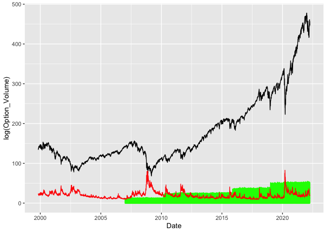
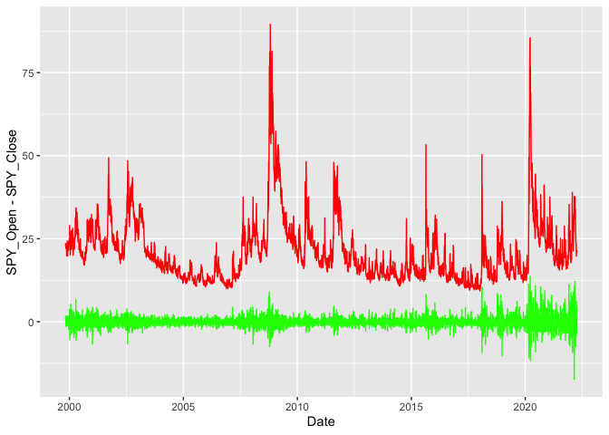
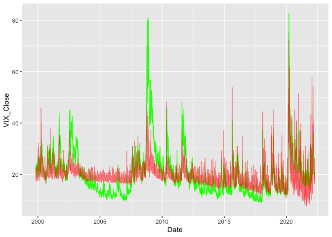
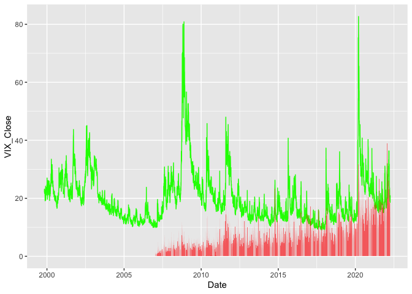
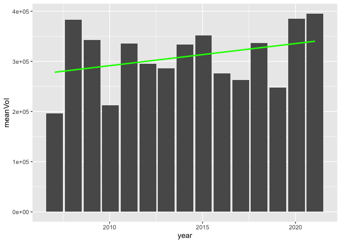
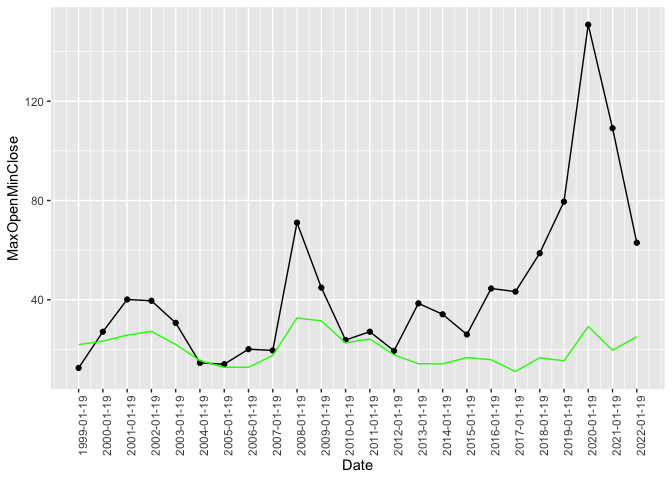
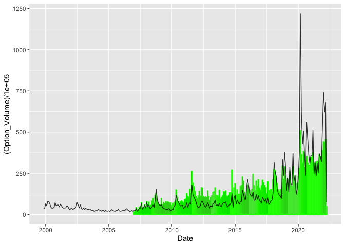
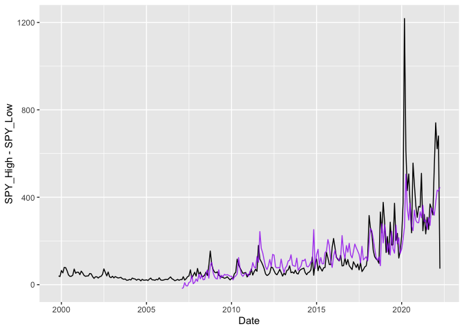
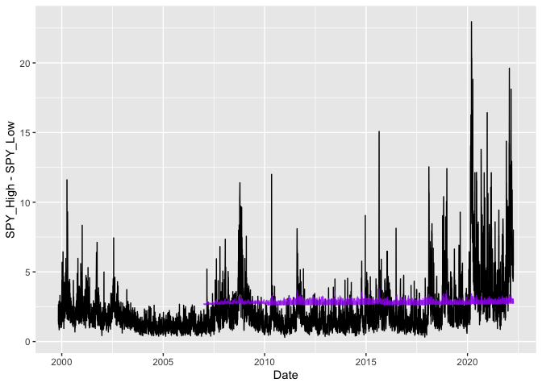
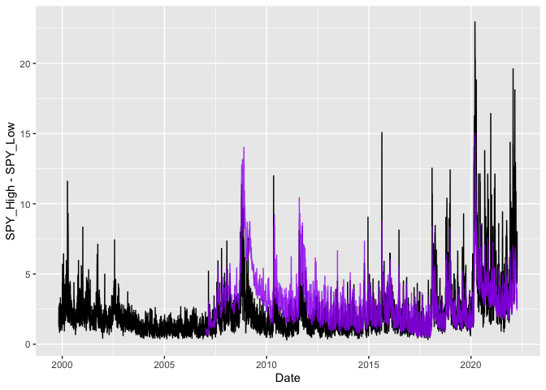

Importing the data.
<https://www.alphavantage.co/query?function=TIME_SERIES_DAILY&symbol=SPY&outputsize=full&datatype=csv&apikey=demo>

CBOE CSV downloads
<https://www.cboe.com/tradable_products/vix/vix_historical_data/>
<https://www.cboe.com/us/options/market_statistics/historical_data/>

Checking that the data got imported correctly.

    print(tail(VIX_History_df)) #2003-present

    ##            DATE  OPEN  HIGH   LOW CLOSE
    ## 8120 03/29/2022 19.70 19.73 18.67 18.90
    ## 8121 03/30/2022 19.38 20.51 18.72 19.33
    ## 8122 03/31/2022 19.68 21.48 19.54 20.56
    ## 8123 04/01/2022 20.62 20.86 19.41 19.63
    ## 8124 04/04/2022 20.75 20.78 18.45 18.57
    ## 8125 04/05/2022 18.79 21.57 18.55 21.03

    #print(head(VIX_History_archive_df)) #1990-2003

    print(tail(SPY_History_Daily_Volume_df)) #2007-present

    ##      Trade.Date Underlying Product.Type Exchange Volume
    ## 9315 2022/04/04        SPY            S     CBOE 550857
    ## 9316 2022/04/04        SPY            S     EDGX 297801
    ## 9317 2022/04/05        SPY            S     BATS 384345
    ## 9318 2022/04/05        SPY            S       C2 227451
    ## 9319 2022/04/05        SPY            S     CBOE 605973
    ## 9320 2022/04/05        SPY            S     EDGX 308781

    print(tail(SPY_History_Daily_df)) #1999-Present

    ##       timestamp     open     high      low    close  volume
    ## 5640 1999-11-08 137.0000 138.3750 136.7500 138.0000 4649200
    ## 5641 1999-11-05 138.6250 139.1093 136.7812 137.8750 7431500
    ## 5642 1999-11-04 136.7500 137.3593 135.7656 136.5312 7907500
    ## 5643 1999-11-03 136.0000 136.3750 135.1250 135.5000 7222300
    ## 5644 1999-11-02 135.9687 137.2500 134.5937 134.5937 6516900
    ## 5645 1999-11-01 136.5000 137.0000 135.5625 135.5625 4006500

Cleaning up the data frames.

    names(VIX_History_df) <- c("Date","VIX_Open","VIX_High","VIX_Low","VIX_Close")
    names(SPY_History_Daily_Volume_df) <-c("Date","Underlying","Product","Exchange","Option_Volume")
    names(SPY_History_Daily_df) <- c("Date", "SPY_Open", "SPY_High", "SPY_Low", "SPY_Close", "SPY_Volume")

    VIX_History_df$Date <- as.Date(VIX_History_df$Date,"%m/%d/%Y")

    SPY_History_Daily_df$Date <- as.Date(SPY_History_Daily_df$Date,"%Y-%m-%d")

    SPY_History_Daily_Volume_df$Date <- as.Date(SPY_History_Daily_Volume_df$Date,"%Y/%m/%d")

    SPY_History_Daily_Volume_df$Underlying <- NULL
    SPY_History_Daily_Volume_df$Product <- NULL
    SPY_History_Daily_Volume_df$Exchange <- NULL

Joining the data frames.

    joined_df <- SPY_History_Daily_Volume_df

    joined_df <- right_join(joined_df,VIX_History_df,by="Date")

    joined_df <- right_join(joined_df,SPY_History_Daily_df,by="Date")
    head(joined_df)

    ##         Date Option_Volume VIX_Open VIX_High VIX_Low VIX_Close SPY_Open
    ## 1 2007-01-03         62310    12.16    12.75   11.53     12.04   142.25
    ## 2 2007-01-04        135252    12.40    12.42   11.28     11.51   141.23
    ## 3 2007-01-05         86034    11.84    12.25   11.68     12.14   141.33
    ## 4 2007-01-08         67638    12.48    12.83   11.78     12.00   140.82
    ## 5 2007-01-09         92206    11.86    12.47   11.69     11.91   141.31
    ## 6 2007-01-10         68067    12.34    12.50   11.43     11.47   140.58
    ##   SPY_High SPY_Low SPY_Close SPY_Volume
    ## 1   142.86  140.57    141.37   94807600
    ## 2   142.05  140.61    141.67   69620600
    ## 3   141.40  140.38    140.54   76645300
    ## 4   141.41  140.25    141.19   71655000
    ## 5   141.60  140.40    141.07   75680100
    ## 6   141.57  140.30    141.54   72428000

Graph 1.

    library(ggplot2)

    joined_df %>% ggplot()+geom_bar(aes(x=Date,y=log(Option_Volume)),color="green",stat = "identity") + geom_line(aes(x=Date,y=SPY_Close)) + geom_line(aes(x=Date,y=VIX_Close),color="red") 

    ## Warning: Removed 1803 rows containing missing values (position_stack).

    ## Warning: Removed 1 row(s) containing missing values (geom_path).

    joined_df %>% ggplot()+geom_line(aes(x=Date,y=SPY_Open-SPY_Close),color="green") + geom_line(aes(x=Date,y=VIX_High),color="red") + theme(legend.position="right")

    ## Warning: Removed 1 row(s) containing missing values (geom_path).

    cor(x=joined_df$VIX_Close,y=(joined_df$SPY_High-joined_df$SPY_Low),use="complete.obs")

    ## [1] 0.592714

    openCloseVolatilityModel <- lm(VIX_Close ~ SPY_High + SPY_Low, data=joined_df)
    summary(openCloseVolatilityModel)

    ## 
    ## Call:
    ## lm(formula = VIX_Close ~ SPY_High + SPY_Low, data = joined_df)
    ## 
    ## Residuals:
    ##     Min      1Q  Median      3Q     Max 
    ## -28.082  -3.713  -1.229   2.641  47.638 
    ## 
    ## Coefficients:
    ##             Estimate Std. Error t value Pr(>|t|)    
    ## (Intercept) 19.76211    0.13707   144.2   <2e-16 ***
    ## SPY_High     2.65166    0.02615   101.4   <2e-16 ***
    ## SPY_Low     -2.68447    0.02642  -101.6   <2e-16 ***
    ## ---
    ## Signif. codes:  0 '***' 0.001 '**' 0.01 '*' 0.05 '.' 0.1 ' ' 1
    ## 
    ## Residual standard error: 6.027 on 11117 degrees of freedom
    ##   (3 observations deleted due to missingness)
    ## Multiple R-squared:  0.4836, Adjusted R-squared:  0.4835 
    ## F-statistic:  5205 on 2 and 11117 DF,  p-value: < 2.2e-16

As expected here the correlation between the Open - Close of the SPY is
very closely related with how the volatility index closes with a
correlation of 0.59

    joined_df %>% ggplot() + geom_line(aes(x=Date,y=VIX_Close),color="green") + geom_line(aes(x=Date,
      y=(
      2.65166*joined_df[joined_df$Date == Date,"SPY_High"] + #Model as a line
      -2.68447*joined_df[joined_df$Date == Date,"SPY_Low"] +
      19.76211
      )
      ),color="red",alpha=0.5)

    ## Warning: Use of `joined_df$Date` is discouraged. Use `Date` instead.

    ## Warning: Use of `joined_df$Date` is discouraged. Use `Date` instead.

    ## Warning: Removed 1 row(s) containing missing values (geom_path).

So here we can see the model graphed onto the actual value of the VIX at
close while it isn’t perfect and has some inconsistencies we can see the
overall shape is similar to a degree. This correlation is somewhat
obvious as large differences within the High and Low is one of the
indications of volitality.

    joined_df %>% ggplot() + geom_line(aes(x=Date,y=VIX_Close),color="green") + geom_bar(aes(x=Date,y=(Option_Volume)/100000),fill="red",alpha=0.5,stat="identity")

    ## Warning: Removed 1803 rows containing missing values (position_stack).

    ## Warning: Removed 1 row(s) containing missing values (geom_path).

While option volume has trended upwards the volume still has peaks
during periods of high volatility looking at this graph

    cor(x=joined_df$VIX_Close,y=joined_df$Option_Volume,use="complete.obs")

    ## [1] 0.2776767

    cor(x=joined_df$VIX_High,y=joined_df$Option_Volume,use="complete.obs")

    ## [1] 0.2914515

Here we can see a correlation between VIX\_Close and and the
Option\_Volume with 0.277 although this value suggests correlation it is
smaller than expected. The correlation between VIX\_High and
Option\_Volume is a little higher at 0.291, but this is still lower than
expected. This could be related to the upwards trending value of option
volume increasing year over year.

    groupedYearOptionVolumeDF <- joined_df %>% group_by(format(Date,format="%Y")) %>% summarise(mean(Option_Volume))
    groupedYearOptionVolumeDF <- drop_na(groupedYearOptionVolumeDF)
    names(groupedYearOptionVolumeDF) <- c('year','meanVol')
    groupedYearOptionVolumeDF$year <- as.Date(groupedYearOptionVolumeDF$year,format = "%Y")
    head(groupedYearOptionVolumeDF)

    ## # A tibble: 6 × 2
    ##   year       meanVol
    ##   <date>       <dbl>
    ## 1 2007-01-19 195997.
    ## 2 2008-01-19 383009.
    ## 3 2009-01-19 343151.
    ## 4 2010-01-19 212397.
    ## 5 2011-01-19 335598.
    ## 6 2012-01-19 295603.

    groupedYearOptionVolumeDF %>% ggplot(aes(x=year,y=meanVol)) + geom_col() + geom_smooth(method=lm,color="green",se=FALSE)

    ## `geom_smooth()` using formula 'y ~ x'

We can see here a slight upwards trend with stock option volume
increasing year by year.

    yearedJoinedDF <- joined_df %>% mutate(Year=as.Date(format(Date,format="%Y"),format="%Y"))

    yearsIn <- unique(yearedJoinedDF$Year)
    opvCors <- vector(length=length(yearsIn))
    for(i in 1:length(yearsIn)) {
      if(yearsIn[i] >= as.Date("2007-01-01")) {
        filteredDFbyYear <- yearedJoinedDF %>% filter(Year==yearsIn[i])
        opvCors[i] <- cor(x=filteredDFbyYear$VIX_High, y=filteredDFbyYear$Option_Volume,use="complete.obs")
      }
    }
    opvCorsDF <- data.frame(yearsIn,opvCors)
    opvCorsDF

    ##       yearsIn    opvCors
    ## 1  2007-01-19 0.65704329
    ## 2  2008-01-19 0.37462373
    ## 3  2009-01-19 0.06091583
    ## 4  2010-01-19 0.25881515
    ## 5  2011-01-19 0.29428079
    ## 6  2012-01-19 0.13725041
    ## 7  2013-01-19 0.21572303
    ## 8  2014-01-19 0.40245684
    ## 9  2015-01-19 0.34024565
    ## 10 2016-01-19 0.17640350
    ## 11 2017-01-19 0.23849075
    ## 12 2018-01-19 0.40314588
    ## 13 2019-01-19 0.31104939
    ## 14 2020-01-19 0.39064397
    ## 15 2021-01-19 0.32332596
    ## 16 2022-01-19 0.28479220
    ## 17 1999-01-19 0.00000000
    ## 18 2000-01-19 0.00000000
    ## 19 2001-01-19 0.00000000
    ## 20 2002-01-19 0.00000000
    ## 21 2003-01-19 0.00000000
    ## 22 2004-01-19 0.00000000
    ## 23 2005-01-19 0.00000000
    ## 24 2006-01-19 0.00000000

    mean(opvCorsDF$opvCors)

    ## [1] 0.2028836

Interestingly enough the correlation between the VIX\_High and
Option\_Volume separated by years is actually lower than the correlation
of all the data together. But something interesting happens here where
certain years have a very high correlation while others don’t.

    recissionDF <-joined_df %>% group_by(format(Date,format="%Y")) %>% summarise((max(SPY_Open)-min(SPY_Close)),mean(VIX_Close,na.rm=TRUE))

    names(recissionDF) <- c("Date","MaxOpenMinClose","AvgVIXClose")
    recissionDF$Date <- as.Date(recissionDF$Date,format="%Y")
    recissionDF

    ## # A tibble: 24 × 3
    ##    Date       MaxOpenMinClose AvgVIXClose
    ##    <date>               <dbl>       <dbl>
    ##  1 1999-01-19            12.5        21.9
    ##  2 2000-01-19            27.1        23.3
    ##  3 2001-01-19            40.1        25.7
    ##  4 2002-01-19            39.6        27.3
    ##  5 2003-01-19            30.7        22.0
    ##  6 2004-01-19            14.6        15.5
    ##  7 2005-01-19            14.0        12.8
    ##  8 2006-01-19            20.1        12.8
    ##  9 2007-01-19            19.6        17.5
    ## 10 2008-01-19            71.1        32.7
    ## # … with 14 more rows

    recissionDF %>% ggplot() + geom_line(aes(x=Date,y=MaxOpenMinClose))+ geom_point(aes(x=Date,y=MaxOpenMinClose)) + geom_line(aes(x=Date,y=AvgVIXClose),color="green") + scale_x_continuous(breaks=unique((recissionDF$Date))) + theme(axis.text.x = element_text(angle = 90))

Using this graph we can see periods of recession as the difference
between the highest high and lowest low and the mean of the volitality
align. So we can see the 2001, 2008, and the most recent 2020 recession.
Since we only have data for option volume past 2007, so the 2008 and
2020 recessions are what we will focus on comparing option volume.

    recDF2 <- joined_df %>% filter(format(Date,"%Y") %in% c("2007","2008","2019","2020"))

    recDF3 <- joined_df %>% filter(format(Date,"%Y") %in% c("2008","2009","2020","2021"))

    cor(recDF2$VIX_High,recDF2$Option_Volume)

    ## [1] 0.48005

    cor(recDF3$VIX_High,recDF3$Option_Volume)

    ## [1] 0.2685189

Looking at only periods of high volatility like recessions and the year
right before them we get the highest correlation yet of 0.480. This is
indicative of a strong relationship especially in the stock market where
there is a huge amount of factors. On the other hand looking at years of
recession and the year right after we see a significant drop in
correlation with only 0.268.

Knowing this correlation between option volume and the volatility index,
and also knowing the correlation between the range of the SPY and the
volatility index let’s check the relation between the option volume and
range of the SPY.

    cor(joined_df$SPY_High-joined_df$SPY_Low,lag(joined_df$Option_Volume),use="complete.obs")

    ## [1] 0.364789

This is a pretty good correlation between the range of the day

    monthYearDF <- joined_df %>% mutate(Month=as.numeric(format(Date,format="%m"))) %>% mutate(Year=as.numeric(format(Date,format="%Y")))

    aggregatedOV <- aggregate(Option_Volume~Month+Year,data=monthYearDF,FUN=sum)
    aggregatedSPYHigh <- aggregate(SPY_High~Month+Year,data=monthYearDF,FUN=sum)
    aggregatedSPYLow <- aggregate(SPY_Low~Month+Year,data=monthYearDF,FUN=sum)

    aggregatedJoined <- full_join(aggregatedOV,aggregatedSPYHigh,by=c("Month","Year")) %>% full_join(aggregatedSPYLow,by=c("Month","Year"))
    head(aggregatedJoined)

    ##   Month Year Option_Volume SPY_High SPY_Low
    ## 1     1 2007       1741418  2856.53 2833.04
    ## 2     2 2007       2113684  2758.55 2735.68
    ## 3     3 2007       4276541  3112.99 3076.54
    ## 4     4 2007       2930866  2933.63 2912.72
    ## 5     5 2007       2865882  3342.05 3315.02
    ## 6     6 2007       4337983  3201.24 3164.94

    aggregatedJoined <- aggregatedJoined %>% mutate(Date=as.Date(paste(as.character(Year),as.character(Month),"01",sep="-",format="%Y-%m-%d")))
    tail(aggregatedJoined)

    ##     Month Year Option_Volume SPY_High SPY_Low       Date
    ## 265     7 2006            NA  2533.81 2506.69 2006-07-01
    ## 266     8 2006            NA  2976.91 2953.55 2006-08-01
    ## 267     9 2006            NA  2645.30 2627.03 2006-09-01
    ## 268    10 2006            NA  3005.79 2985.18 2006-10-01
    ## 269    11 2006            NA  2931.34 2907.33 2006-11-01
    ## 270    12 2006            NA  2844.50 2824.69 2006-12-01

    aggregatedJoined %>% ggplot() + geom_col(aes(x=Date,y=(Option_Volume)/100000),color="green")+ geom_line(aes(x=Date,y=SPY_High-SPY_Low),alpha=0.8)

    ## Warning: Removed 86 rows containing missing values (position_stack).

Looking at the summed option volume mapped onto a similar scale as the
difference in the sums of the high and sums of the low we can see an
obvious correlation.

    cor(aggregatedJoined$Option_Volume,aggregatedJoined$SPY_High - aggregatedJoined$SPY_Low,use="complete.obs")

    ## [1] 0.8987706

    cor(lag(aggregatedJoined$Option_Volume),aggregatedJoined$SPY_High - aggregatedJoined$SPY_Low,use="complete.obs")

    ## [1] 0.7380893

As confirmed in the graph above we get the previous months option volume
and the month afters difference in sums are very correlated with a
correlation of 0.738.

    aggregatedJoined <- aggregatedJoined %>% mutate(lagOV = lag(Option_Volume))

    mmBools <- sample(c(TRUE,FALSE),replace=TRUE,prob=c(0.8,0.2))
    mmTrain <- aggregatedJoined[mmBools,]
    mmTest <- aggregatedJoined[!mmBools,]

    monthModel <- lm((SPY_High-SPY_Low) ~ lagOV,data=mmTrain)
    summary(monthModel)

    ## 
    ## Call:
    ## lm(formula = (SPY_High - SPY_Low) ~ lagOV, data = mmTrain)
    ## 
    ## Residuals:
    ##     Min      1Q  Median      3Q     Max 
    ## -424.85  -46.56   -8.35   26.83  930.67 
    ## 
    ## Coefficients:
    ##               Estimate Std. Error t value Pr(>|t|)    
    ## (Intercept) -5.621e+01  1.563e+01  -3.597 0.000414 ***
    ## lagOV        1.223e-05  8.290e-07  14.758  < 2e-16 ***
    ## ---
    ## Signif. codes:  0 '***' 0.001 '**' 0.01 '*' 0.05 '.' 0.1 ' ' 1
    ## 
    ## Residual standard error: 107.9 on 182 degrees of freedom
    ##   (86 observations deleted due to missingness)
    ## Multiple R-squared:  0.5448, Adjusted R-squared:  0.5423 
    ## F-statistic: 217.8 on 1 and 182 DF,  p-value: < 2.2e-16

    predMM <- predict(monthModel,newdata=mmTest)

    rmseMM <- sqrt(mean(((predMM)-(mmTest$SPY_High-mmTest$SPY_Low))^2,na.rm = TRUE))
    rmseMM

    ## [1] NaN

    aggregatedJoined %>% ggplot() + geom_line(aes(x=Date,y=SPY_High-SPY_Low)) + geom_line(aes(
      x=Date,
      y=1.064e-05*lagOV + -3.632e+01
    ),color="Purple",alpha=0.8)

    dailyWithLag <- joined_df %>% mutate(lagOV = lag(Option_Volume)) %>% mutate(lagVIX = lag(VIX_Close))
    cor(dailyWithLag$SPY_High- dailyWithLag$SPY_Low,dailyWithLag$lagOV,use="complete.obs")

    ## [1] 0.364789

    mmBools <- sample(c(TRUE,FALSE),replace=TRUE,prob=c(0.8,0.2))
    mmTrain <- dailyWithLag[mmBools,]
    mmTest <- dailyWithLag[!mmBools,]

    monthModel <- lm((SPY_High-SPY_Low) ~ lagOV,data=mmTrain)
    summary(monthModel)

    ## 
    ## Call:
    ## lm(formula = (SPY_High - SPY_Low) ~ lagOV, data = mmTrain)
    ## 
    ## Residuals:
    ##     Min      1Q  Median      3Q     Max 
    ## -6.7790 -1.2668 -0.5404  0.5747 20.2807 
    ## 
    ## Coefficients:
    ##              Estimate Std. Error t value Pr(>|t|)    
    ## (Intercept) 1.542e+00  4.155e-02   37.12   <2e-16 ***
    ## lagOV       3.945e-06  1.043e-07   37.82   <2e-16 ***
    ## ---
    ## Signif. codes:  0 '***' 0.001 '**' 0.01 '*' 0.05 '.' 0.1 ' ' 1
    ## 
    ## Residual standard error: 2.384 on 9318 degrees of freedom
    ##   (1803 observations deleted due to missingness)
    ## Multiple R-squared:  0.1331, Adjusted R-squared:  0.133 
    ## F-statistic:  1430 on 1 and 9318 DF,  p-value: < 2.2e-16

    predMM <- predict(monthModel,newdata=mmTest)

    rmseMM <- sqrt(mean(((predMM)-(mmTest$SPY_High-mmTest$SPY_Low))^2,na.rm = TRUE))
    rmseMM

    ## [1] NaN

    dailyWithLag %>% ggplot() + geom_line(aes(x=Date,y=SPY_High-SPY_Low)) + geom_line(aes(
      x=Date,
      y=(5.096e-07*lagOV + 2.634e+00)
    ),color="Purple",alpha=0.8)

    ## Warning: Removed 1 row(s) containing missing values (geom_path).

    mmBools <- sample(c(TRUE,FALSE),replace=TRUE,prob=c(0.8,0.2))
    mmTrain <- dailyWithLag[mmBools,]
    mmTest <- dailyWithLag[!mmBools,]

    monthModel <- lm((SPY_High-SPY_Low) ~ lagOV+lagVIX,data=mmTrain)
    summary(monthModel)

    ## 
    ## Call:
    ## lm(formula = (SPY_High - SPY_Low) ~ lagOV + lagVIX, data = mmTrain)
    ## 
    ## Residuals:
    ##     Min      1Q  Median      3Q     Max 
    ## -6.7073 -0.8226 -0.0888  0.5723 12.2219 
    ## 
    ## Coefficients:
    ##               Estimate Std. Error t value Pr(>|t|)    
    ## (Intercept) -1.148e+00  5.941e-02  -19.32   <2e-16 ***
    ## lagOV        5.222e-06  1.065e-07   49.05   <2e-16 ***
    ## lagVIX       1.236e-01  3.017e-03   40.96   <2e-16 ***
    ## ---
    ## Signif. codes:  0 '***' 0.001 '**' 0.01 '*' 0.05 '.' 0.1 ' ' 1
    ## 
    ## Residual standard error: 1.639 on 4657 degrees of freedom
    ##   (901 observations deleted due to missingness)
    ## Multiple R-squared:  0.5893, Adjusted R-squared:  0.5891 
    ## F-statistic:  3341 on 2 and 4657 DF,  p-value: < 2.2e-16

    predMM <- predict(monthModel,newdata=mmTest)

    rmseMM <- sqrt(mean(((predMM)-(mmTest$SPY_High-mmTest$SPY_Low))^2,na.rm = TRUE))
    rmseMM

    ## [1] 2.449016

    dailyWithLag %>% ggplot() + geom_line(aes(x=Date,y=SPY_High-SPY_Low)) + geom_line(aes(
      x=Date,
      y=lagOV*2.300e-06 + lagVIX * 1.625e-01 + -1.066e+00 
    ),color="Purple",alpha=0.8)

    ## Warning: Removed 1 row(s) containing missing values (geom_path).

